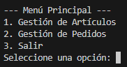
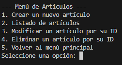
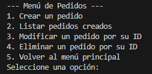
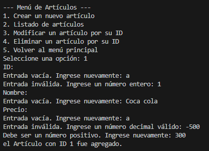

# 📦 **Pre Entrega Proyecto JAVA - Talento Tech / 2025** 

---

## 🚀 Descripción

Este proyecto es una **aplicación Java por consola** diseñada para administrar artículos y gestionar pedidos asociados.  
Permite crear, modificar, listar y eliminar tanto artículos como pedidos a través de una interfaz por consola con menú de opciones.

---

## 💻 Tecnologías y Lenguaje

- Lenguaje: **Java**
- IDE recomendado: Realizado en VSC, pero puede tambíen utilizarse Eclipse, IntelliJ IDEA o NetBeans
- No contiene librerías externas, solo Java puro
- Interfaz: Consola de comandos

---

## 🛠️ Características principales

- **Creación, modificación y eliminación de Artículos**  
- **Creación, modificación y eliminación de Pedidos**  
- Asociación de **varios artículos a un pedido**  
- Cálculo automático de subtotales y totales en pedidos  

- **Validaciones manuales** implementadas con `if` y `while`
- Lectura segura de datos: enteros, doubles y textos sin valores vacíos ni inválidos  
- Uso de **ArrayList** para almacenar artículos y pedidos  
- Uso de **POO** con clases `Articulo` y `Pedido`  

- **Encapsulamiento** con métodos `get` y `set` para proteger datos internos  
- Menús separados para gestión de artículos y pedidos usando `switch-case`

---

## 🛠️ Capturas de pantalla

- **Menu Principal**



- **Menú Artículos**




- **Menú Pedidos**




- **Validaciones de las opciones ingresadas al crear un Artículo**




## ‍💻 Realizado por Alberto Buituron 

## 📂 Estructura del Proyecto

```plaintext
src/
├── Articulo.java        # Clase para manejar los artículos
├── Pedido.java          # Clase para manejar los pedidos
└── Main.java            # Clase principal con el menú y la lógica de interacción


---

